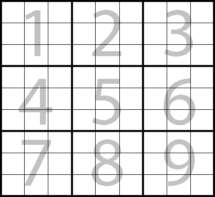

# TDD, Object Calisthenics

This kata focuses on **Object Calisthenics**. Object calisthenics forces people to think differently about software design, not by adding anything, but by removing. Object calisthenics is about constraining software design decisions; it is about what you cannot do.

Object calisthenics is a simple ruleset that, if applied correctly, should have a big effect on your design. For the time being, follow these rules. We will discuss the principles behind them later on.

1. **Only one level of indentation per method.**
2. **Keep all entities small. (50 lines per class, 5 lines per method, 2 arguments per method).**
3. **Wrap all primitives and strings (wrap primitive types in classes).**
4. **One dot per line.**
5. First class collections (wrap collections in classes).
6. Don’t abbreviate.
7. Don’t use the ELSE keyword. 
8. No classes with more than two instance variables.
9. No getters/setters/properties.
10. All classes must have state.

Object calisthenics does not give you anything new. On the contrary, it takes stuff away. Expect these rules/constraints to be challenging/frustrating if you never used them before. Be strict for now. No exceptions! The time to bend the rules has not yet come. :)

# Exercise

We will be writting a tic tac toe application. We will write it like last Using TDD but this will also apply object calisthenics rules.

# Tic Tac Toe rules
- There are two players in the game , **X** and **O**
- players take turns taking fields until the game is over.
- a game has nine fields in a 3x3 grid
- **X** always goes first.
- Players alternate placing **X’s** and **O’s** on the board.
- Players cannot play on a played position.
- A player with three X’s or O’s in a row (horizontally, vertically, diagonally) wins.
- If all nine squares are filled and neither player achieves three in a row, the game is a draw.

# Outcomes
- If player X wins print "Player X wins"
- If player O wins print "Player O wuins".
- If now one wins and board fills up completely, print "Draw"
